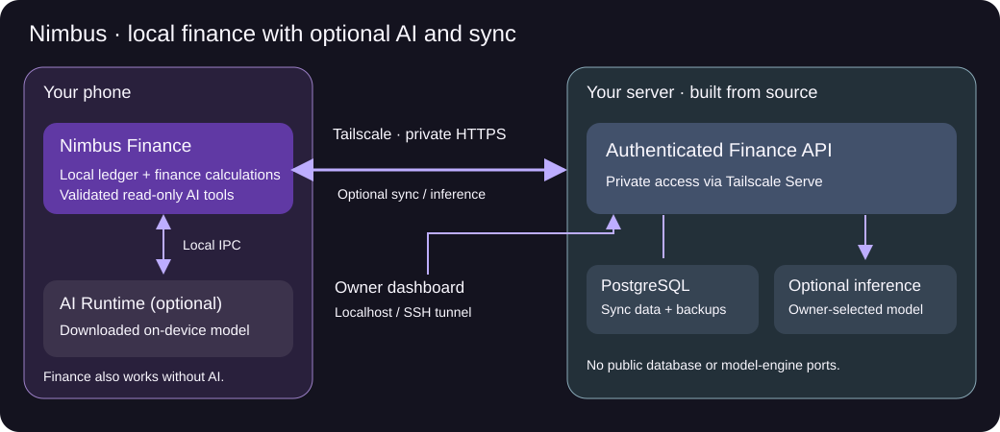

# Nimbus Finance Server

Run your own server for Nimbus Finance synchronization, shared groups and optional AI assistance. Download the Android apps from [Nimbus Finance](https://github.com/mugilnimbus/Nimbus_Finance/tree/main/dist).

Clone the server source and build it on your computer using the steps below. Your database, credentials, models and backups remain local.

## Architecture



Nimbus Finance owns the phone ledger and financial calculations. The optional AI Runtime app runs models on the phone without this server. For server use, the phone connects through Tailscale HTTPS to the Finance API. PostgreSQL stores synchronized records, a backup service creates encrypted copies, and the owner dashboard controls optional server AI.

The backend uses Kotlin/JVM, Java 17 and Ktor/Netty. Gradle builds the server; Docker runs the API, PostgreSQL, backups, Tailscale and optional inference. The database and inference engine have no public host ports.

## 1. Prepare your computer

The guided setup currently supports **Windows on an Intel/AMD 64-bit computer** using Linux containers. Linux/macOS setup helpers and ARM builds are not validated by this guide. You do not need Android Studio or an Android SDK to run the server.

Install these once:

1. [Docker Desktop](https://docs.docker.com/desktop/setup/install/windows-install/). Complete its WSL2 setup, restart if asked, open Docker Desktop and wait for the engine to start. Select Linux containers.
2. [Git for Windows](https://git-scm.com/downloads/win).
3. [PowerShell 7](https://learn.microsoft.com/en-us/powershell/scripting/install/install-powershell-on-windows). Use this instead of the older Windows PowerShell.
4. **Temurin JDK 17**, not just a JRE, from [Adoptium](https://adoptium.net/temurin/releases/?version=17). In its installer enable **Add to PATH** and **Set JAVA_HOME**. See the [installer instructions](https://adoptium.net/installation/windows).

Open a new PowerShell 7 window after installation and check:

```powershell
git --version
java -version
javac -version
docker compose version
docker info --format '{{.OSType}}'
```

You should see Git and Java versions, Java compiler version 17, Docker Compose 2.30 or newer, and `linux`. If a command is missing, finish its installation and reopen PowerShell.

Keep the computer powered on, awake and connected to the internet while using phone sync or server AI. The first build downloads dependencies and images; allow time and disk space. AI models need additional memory and storage. Finance still works locally when the server is offline.

## 2. Clone the server

In PowerShell, go to a folder where you want to keep the server, then run:

```powershell
git clone https://github.com/mugilnimbus/Nimbus-Finance-Server.git
cd Nimbus-Finance-Server
Get-ChildItem
```

You should see `README.md`, `docker-compose.yml`, `gradlew.bat`, `server` and `scripts`. Run the following commands from this folder, not the mobile downloads repository.

You do not need to edit the source. Keep this folder: it will hold your local configuration, models and backups.

## 3. Set up your own Tailscale network

Tailscale provides the private connection between your phone and server. It is separate from your Nimbus login.

1. Open the [Tailscale admin console](https://login.tailscale.com/admin/) and sign in using your own account. Remember the email and sign-in provider.
2. If onboarding asks for a first device, install Tailscale on your phone using Step 5, then return here.
3. In **DNS**, enable **MagicDNS** and **HTTPS Certificates**. Read the certificate notice and use a non-sensitive server hostname.
4. Under **Settings → Keys**, generate an auth key for the server. Leave **Reusable** and **Ephemeral** off. Keep the key private; setup asks for it using a hidden prompt. If device approval is enabled, approve the server after it joins.
5. Do not put this key in GitHub, screenshots, issues or the phone's Nimbus login.

The Docker setup runs Tailscale for the server; a separate desktop Tailscale installation is not required for this path. Each phone connecting to the server needs the Android Tailscale app. [Tailscale auth keys](https://tailscale.com/docs/features/access-control/auth-keys) · [HTTPS setup](https://tailscale.com/docs/how-to/set-up-https-certificates)

## 4. Build and start the server

Keep Docker Desktop running. From the cloned server folder:

```powershell
./scripts/setup-server.ps1 -StartTailscale
```

Paste the auth key when prompted. The script creates local credentials if missing, builds/tests the server with Java, builds the Docker images and starts the services. Existing credentials and database volumes are preserved on reruns. Do not close the terminal while the first build is running.

When setup finishes:

```powershell
./scripts/server-status.ps1
./scripts/get-server-address.ps1
./scripts/open-dashboard.ps1
```

The dashboard opens on your computer. Save your actual **Phone server address**, such as `https://nimbus-finance.example.ts.net`. Do not use this example, `localhost` or `127.0.0.1` on your phone.

**Checkpoint:** the API is ready, database/API/backup containers are running, and Tailscale reports a usable HTTPS address. A backup may need time to finish its first run. Optional inference is not expected yet.

The normal local API/dashboard port is 8080. If it is occupied, stop the conflicting program or ask for help before changing ports; some helper commands currently assume 8080.

Keep `.env`, `.secrets/`, `data/` and `models/` private. They are not included in Git. The dashboard helper obtains a short-lived login link without printing it. Never send your admin key to phone users.

## 5. Connect Tailscale on the phone

1. Install [Tailscale for Android](https://tailscale.com/download/android).
2. Open it, tap **Get Started**, and accept Android's VPN configuration request.
3. Sign in using the same Tailscale account/provider as your server.
4. Turn the connection on and confirm that your server appears in the device list.
5. Keep Tailscale connected whenever using server sync or AI. No exit node is needed.

For someone else's phone/account, invite them using Tailscale's access controls and grant access to this server. Do not share your account password. A separate Nimbus invitation is needed next.

**Checkpoint:** open your actual server address followed by `/health/ready` in the phone browser. It should respond without a connection or certificate error. Never bypass a certificate warning. [Android instructions](https://tailscale.com/docs/install/android)

## 6. Install Finance and create an account

1. Download [Nimbus Finance APK and its checksum](https://github.com/mugilnimbus/Nimbus_Finance/tree/main/dist). The [mobile README](https://github.com/mugilnimbus/Nimbus_Finance#readme) explains installation.
2. On the computer dashboard, open **Create an enrollment QR**, choose an expiry and click **Create invitation**.
3. On the phone, keep Tailscale connected. Open Finance → settings gear → **Sync & backup**.
4. Choose **Scan Nimbus QR** and scan the invitation. Alternatively choose **Create account**, enter the **Server address** and **Registration invite code**.
5. Choose a **Username**, enter your **Name** and a **Password** of at least 12 characters, then tap **Create**.
6. Wait for **Account created and synced**. Existing users choose **Sign in**, not another new account.
7. For another phone belonging to you, connect Tailscale there and sign into the same Nimbus account.

Use a separate one-use registration invitation for each new user. A Nimbus registration invitation is not a Tailscale auth key and is not the server admin key.

## 7. Optional server AI

Skip this section if you only need sync. Server AI currently uses the CUDA inference image and requires a compatible NVIDIA GPU, drivers and working Docker GPU support. It is not a CPU-only or AMD/Apple GPU setup. See [NVIDIA container guidance](https://docs.nvidia.com/datacenter/cloud-native/container-toolkit/latest/install-guide.html).

1. Open the dashboard → **Models and inference → Model library**.
2. Choose a supported model and select **Download model**. Wait for the download to complete. Model licenses and provider access requirements apply.
3. From the server folder, enable inference:

```powershell
./scripts/setup-server.ps1 -StartTailscale -StartInference
```

4. In the dashboard select/activate the downloaded model and wait until it loads. Service startup alone does not mean a model is ready.
5. On the signed-in phone, open **Settings → Advanced options → AI assistant → Private server**.
6. Tap **Test private inference** and wait for **Ready**. Ask a simple balance question and compare it with Home.

No model file is bundled in Git. You do not need the separate AI Runtime app for this server path. Alternatively, install Runtime for on-device AI and skip server inference entirely.

## Everyday commands

Run from the cloned server folder:

```powershell
./scripts/server-status.ps1
./scripts/open-dashboard.ps1
./scripts/get-server-address.ps1
docker compose stop
docker compose start
docker compose logs --tail 100 finance-api
docker compose logs --tail 100 tailscale
./scripts/create-backup.ps1
./scripts/copy-verified-backup.ps1 -Destination "D:/NimbusBackups"
./scripts/restore-drill.ps1
```

Use your own existing private destination for exported backups. `stop` and `start` operate on existing containers; use setup to create/rebuild them. Do not post unredacted logs.

## Backups and updates

Backups run daily by default and keep 30 days under `data/backups/`. Export copies to separate private storage and keep the backup passphrase separately. Losing the passphrase makes encrypted backups unusable. Save encrypted backups from Finance too: server backups do not cover phone-only records, local chat, models or Tailscale identity.

The restore helper tests a backup using an isolated temporary database, not by replacing your live database. Preserve the originals if recovery fails.

Before an update, read version changes, create/export a backup, then from a clean source checkout:

```powershell
git pull --ff-only
./scripts/setup-server.ps1 -StartTailscale
```

Include `-StartInference` if you use server AI. If Git reports local changes, stop and resolve them without overwriting local configuration. Keep `.env`, `.secrets/`, `data/`, `models/` and Docker volumes. Do not blindly downgrade after a schema migration.

Never use `docker compose down -v` or volume pruning for routine cleanup: these can erase your database and Tailscale identity.

## Security and privacy

- Public source does not make your running server public. Access still requires your Tailscale network and Nimbus authentication.
- Tailscale protects transport. Sync is not end-to-end encrypted against the server owner, who can access server-side records.
- Keep the dashboard owner-only. Database and model-engine ports are internal; do not enable router forwarding or Tailscale Funnel.
- Protect the computer's storage, user account and backups. Docker/root administrators can access mounted secrets.
- Financial AI tools are read-only. Verify important answers against app reports.
- Never commit credentials, database/model files, phone/server backups, personal documents or local agent notes.
- Public issues must contain no personal finances, usernames, tokens, invitation codes or private addresses. If the repository offers **Security → Report a vulnerability**, use it for sensitive reports; otherwise request a private reporting channel without posting exploit details.
- Setup/build success is not proof of security, phone connectivity, GPU compatibility or a successful restore. Check the relevant behavior on your own deployment.

## Troubleshooting

| Problem | What to check |
|---|---|
| JDK not found | Install JDK 17 with PATH and JAVA_HOME, reopen PowerShell, check java and javac. |
| Docker cannot connect | Start Docker Desktop and choose Linux containers. |
| First build fails | Read the first build error; check internet access, Java 17, disk space and dependency downloads. Do not delete server data. |
| Private HTTPS not ready | Tailscale account, device approval, MagicDNS and HTTPS certificates. Rerun setup after correcting settings. |
| Phone cannot connect | Phone Tailscale VPN connected, correct account/access and actual HTTPS server address; keep the computer awake. |
| Valid access token required | Sign into Nimbus; do not substitute the admin key. |
| Model unavailable | GPU support, inference enabled, completed download and selected/loaded model. |
| Sync error | Review server/app status and preserve records; do not clear data as a workaround. |

## Local development

Source is in `server/`; Docker configuration is in `infrastructure/` and `docker-compose.yml`. `Application.kt` handles HTTP routes and database operations, `ServerConfig.kt` loads validated configuration, and `Protocol.kt` defines request/response payloads. Inference and owner model controls remain separate modules. Session settings accept 5–240 idle minutes and 1–8 sessions per user; invalid numbers or empty secret files stop startup with a configuration error.

To test and build without starting containers:

```powershell
./gradlew.bat :server:test :server:buildFatJar --dependency-verification=strict
```

This repository does not include GitHub publishing or audit workflows. A source push does not restart anyone's server. Third-party dependencies and models retain their respective licenses.
